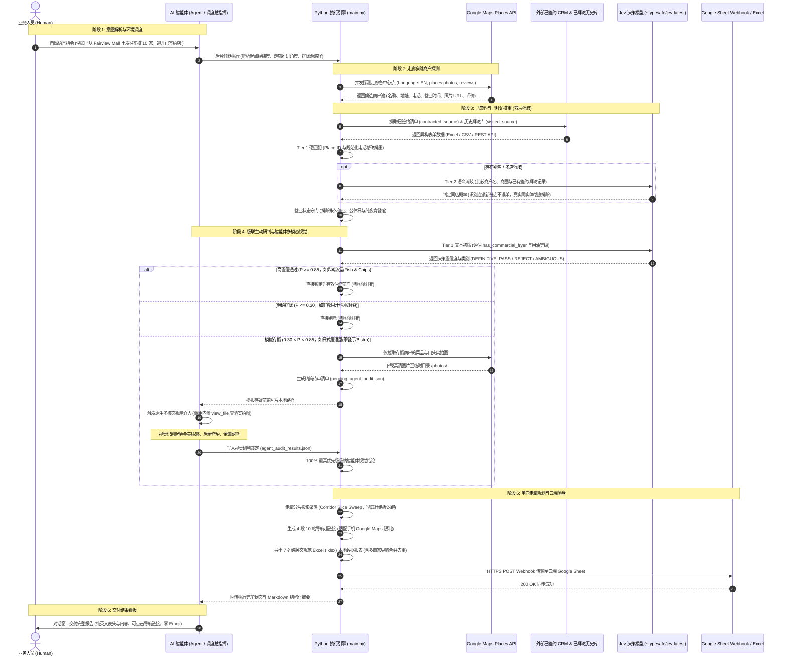

# Universal Public Place Scout & Route Planner

面向 AI 智能体的全球公开场所与商户拓客、路线导航规划技能（支持餐饮供应链、商用设备巡检、精品咖啡、汽车后市场、健身俱乐部、齿科诊所、零售地推及商务拜访等多行业场景）。

自动化执行全流程：在全球任意地区或指定走廊/商圈检索英文 Google Maps 公开场所（餐厅、咖啡馆、汽修洗车、健身房、诊所、零售店等），通过多模态视觉与 Jev 语义决策模型对商户设施与服务进行自定义研判，排除已签约与历史已拜访地点，锁定目标拜访场所（默认 30 家，可自由配置），规划无折返跑的高效推进路线，生成无缝衔接的 Google Maps 导航链接，并落盘至 Google Sheet 与 7 列纯英文规范表格。

---

## 核心能力

1. **零代码交互式安装向导（Zero-Code Setup Wizard）**：
   - 用户首次启动或运行 `--setup` 时，通过终端问答即可完成 Google Maps API Key、Google Sheet 目标链接与默认起点的配置。
   - 自动保存在系统标准用户目录 `~/.config/place_scout/config.json`，无需手动编辑代码或 JSON 语法。
2. **多源异构数据自适应摄取与智能对齐（Multi-Source Schema Normalizer）**：
   - 支持本地 Excel (`.xlsx`)、CSV、JSON 文件以及企业外部 REST API 接口；
   - 自动容错识别千奇百怪的中英文表头（如“商户名/店名/Shop/Title”自动映射为名称，“手机/电话/Tel”自动映射为电话）。
3. **双层模型驱动实体对齐过滤（Tiered Entity Resolution）**：
   - **Tier 1 (硬匹配快速通道)**：基于 Google Place ID 和规范化纯数字电话精确排重（0 Token、毫秒级）；
   - **Tier 2 (TypeSafe Jev 决策模型通道)**：接入 TypeSafe AI 官方 `jev-latest` 类型化决策模型（`noul`/`choice`，`POST https://api.typesafe.ai/v1/systemone`），针对同店不同名、品牌别名、中英文混杂与商圈地址重叠，进行精准语义实体对齐，智能区分同一连锁不同分店（不误杀）与同一实体（彻底排除），未配置 Key 时优雅降级为本地启发式规则。
4. **全球多领域泛化与动态区域提取（Universal Global Discovery）**：
   - 全球任意经纬度或地址起步，动态从 Google Places `addressComponents` 提取行政区划与城市（摒弃固定区域锁与强制国别后缀）；
   - 支持 `--place-types` 自由传入 Google Places API (New) 支持的任意类型（如 `cafe`, `gym`, `car_repair`, `car_wash`, `dentist`, `hotel`, `store` 等）。
5. **动态判定标准与 Jev 模板（Dynamic Criteria & Jev Templates）**：
   - 支持通过 `--template` 选用开箱即用的预设模板（`coffee` 精品咖啡、`auto` 汽车后市场、`fitness` 健身房、`dining` 餐饮美食、`general` 通用标准）；
   - 支持通过 `--criteria` 注入任意自定义自然语言研判标准（如 `"has commercial espresso machine"`, `"offers ceramic coating or PPF"`, `"provides pediatric dentistry"`）。
6. **中间过程文件与系统临时目录隔离（Temp Directory Isolation）**：
   - 待审核场所图片引用与数据保存至系统临时目录 `/tmp/place_scout/audit/`。
   - 无论用户在何处执行脚本，绝不污染用户当前工作目录与代码仓库。
7. **Google Sheet 极简 Apps Script Webhook 云端落盘**：
   - 专为个人与非技术用户打造，无需创建 Google Cloud 开发者账号，无需复杂的服务账号或 OAuth 认证。
   - 仅需在目标 Google Sheet 中粘贴 10 行极简 Apps 脚本并部署为 Web 应用，即可实现零凭据、免密、永不失效的在线表格全自动双向同步与异常看板。
8. **Jev 决策模型与智能体多模态视觉审核（Jev Decision Model & Multimodal Vision）**：
   - 采用 TypeSafe AI `jev-latest` 决策模型对商户分类、描述摘要与用户评价进行特征研判，结合智能体原生多模态视觉查验实拍图片。
9. **防折返跑走廊切片推进算法（Anti-Shuttle Corridor Slice Sweep）**：
   - 将前进走廊按纵向深度切分为局部切片（默认 2.0 km）。在微商圈内就近聚类清扫，片间严格单向向前推进。
10. **分段无缝导航与斜杠总览链接（适配 Google Maps 10 站限制）**：
   - 鉴于 Google Maps 原生移动端及网页端单次导航路线严格限制 **最多 10 个停靠点**（1 个起点 + 9 个途径站），系统自动将路线生成为 **4 段无缝衔接的行驶导航链接**（Leg 1 ~ Leg 4，每段 ≤ 9 站），移动端或车载 CarPlay / Android Auto 点击即开导航；同时提供桌面端全量总览链接。
11. **规范 7 列纯英文数据报表导出 (7-Column Pure English Spreadsheet Export)**：
   - 包含：`No.`、`Place Name`、`Address`（详细地址含 Unit/门牌）、`Navigation Address`（规范主导航地址，多商户同商圈/商场自动垂直合并单元格去重）、`Opening Hours`、`Phone`、`Match Evidence`（全表格内容严格使用纯英文）。
12. **智能开业状态与公休日过滤（Operational Status & Day-of-Week Gatekeeper）**：
   - **停业剔除**：强制过滤 Google Places `CLOSED_PERMANENTLY`（已倒闭）与 `CLOSED_TEMPORARILY`（已歇业）；
   - **公休过滤**：根据计划拜访日期自动计算星期几（如周一/周二），若当天为该店公休日（`Closed`），直接剔除；
   - **时段对齐**：白天拜访时，自动排除 17:00 以后才开门的纯夜间场所（可通过 `--allow-dinner-only` 开启夜间巡检）。

---

## 完整端到端架构时序图 (End-to-End Orchestration Sequence Diagram)

本项目基于 **「人 - 智能体 (Agent) - Python 确定性代码」三位一体协同体系**，串联外部 CRM、历史拜访库、Google Maps、Jev 语义模型与智能体原生多模态视觉：



### 时序图核心交互阶段说明

1. **意图解析与调度 (Human <-> Agent)**：
   业务人员无需记忆或拼装复杂的命令行参数，使用自然语言即可提出拓客目标。智能体（Agent）理解人类意图后，在后台调度 Python 引擎进行精确计算。
2. **多源异构数据消歧过滤 (Engine <-> CRM <-> Jev)**：
   系统对接企业既有的已签约客户库（`contracted_source`）与历史拜访库（`visited_source`）。先走 Place ID/电话硬匹配；遇同品牌分店或别名时，自动调用 Jev 决策模型进行语义级同店识别，既不漏掉可拜访的新分店，又彻底杜绝重复跑腿。
3. **基于置信度的级联主动研判 (Engine <-> Jev <-> Agent Multimodal)**：
   - 确定性高的商家（肯德基、纯沙拉吧）通过 Jev 文本分类在毫秒级快速决断；
   - 处于模糊区间的商家（日式居酒屋、西式简餐 Bistro 等），Python 引擎自动拉取实拍图并派发工单，由**拥有原生多模态视觉的智能体（Agent）调用 `view_file` 肉眼查验后厨与菜品**，将研判结论回传闭环，无需引入任何第三方付费图像 API。
4. **防折返空间规划与云端落盘 (Engine <-> Sheet)**：
   Python 引擎执行沿进轴单向投影（Corridor Slice Sweep），将确认商户编排为不走回头路的高效路线，并一键推送到业务人员的在线 Google Sheet 与本地纯英文 Excel。

---

## 智能体安装与集成指南 (Agent Skill Mounting Guide)

本项目遵循标准 Agent Skills 规范（根目录下包含标准 `SKILL.md` 元数据与工作流定义），支持一键挂载到各类主流 AI 智能体体系（如 **Google Antigravity / Gemini CLI**、**Claude Code**、**Cursor / Windsurf**、**OpenHands** 等）。

### 1. 推荐：通过 Agent Skills 标准包管理器安装 (`npx skills add`)

当前 AI 智能体生态普遍采用开源的 Agent Skills 包管理工具（基于 [skills.sh](https://skills.sh) 标准），无需手动克隆代码库或配置复杂路径，直接通过 `npx` 即可秒级完成安装：

```bash
# 方式 A：安装到当前项目工作区（推荐：自动识别当前 Agent 并放入 .agents/skills/）
npx skills add hellomrleeus/google-maps-place-scout

# 方式 B：全局安装（对本机所有工作区及各类智能体生效，免项目目录占用）
npx skills add hellomrleeus/google-maps-place-scout -g
```

> **工作机制与依赖提示**：
> 1. **自动挂载**：`npx skills` 会自动从 GitHub 检索本项目的 `SKILL.md` 与 `scripts/` 目录，并将其放置于当前项目或全局的技能目录中，智能体会自动建立感知。
> 2. **Python 运行依赖**：`npx skills` 负责技能文件的同步挂载；由于本技能底层使用 Python 3 进行空间计算与数据导出，安装后请确保宿主机安装了基础依赖：
>    ```bash
>    pip install -r requirements.txt
>    ```
>    *(注：智能体首次被唤起执行拓客任务时，也会自动静默检测 Python 环境及依赖，若缺失将引导配置)*

---

### 2. 备用方式：各平台手动挂载与原生脚本 (Manual / Script Mounting Paths)

如果您所处的环境未安装 Node.js / `npx`，或者希望使用纯 Shell 脚本或手动拉取纯净包，可根据使用的智能体类型选择对应的挂载路径：

#### 方案 A：Google Antigravity / Gemini CLI（官方标准规范）
* **项目内工作区纯净免 Git 挂载（秒级解压，绝不污染代码库，严禁单数 `.agent`）**：
  ```bash
  mkdir -p .agents/skills/google-maps-place-scout && \
  curl -sL https://github.com/hellomrleeus/google-maps-place-scout/archive/refs/heads/main.tar.gz | \
    tar -xz -C .agents/skills/google-maps-place-scout --strip-components=1
  ```
  *(注：仅下载 80KB 纯净资源包，全程无 `.git` 文件夹，彻底避免触发任何版本控制冲突与子模块问题)*

* **全局免污染挂载（推荐）：跨所有工程通用，完全不占用项目目录**：
  ```bash
  mkdir -p ~/.gemini/config/skills/google-maps-place-scout && \
  curl -sL https://github.com/hellomrleeus/google-maps-place-scout/archive/refs/heads/main.tar.gz | \
    tar -xz -C ~/.gemini/config/skills/google-maps-place-scout --strip-components=1
  ```

* **或使用一键纯净安装脚本（自动处理环境适配）**：
  ```bash
  # 项目内安装 (自动清理历史遗留 .agent，自动添加 .gitignore)
  curl -fsSL https://raw.githubusercontent.com/hellomrleeus/google-maps-place-scout/main/install.sh | bash

  # 全局安装 (免项目污染)
  curl -fsSL https://raw.githubusercontent.com/hellomrleeus/google-maps-place-scout/main/install.sh | bash -s -- --global
  ```

#### 方案 B：Anthropic Claude Code
* **全局用户级技能挂载（免 Git 纯净包）**：
  ```bash
  mkdir -p ~/.claude/skills/google-maps-place-scout && \
  curl -sL https://github.com/hellomrleeus/google-maps-place-scout/archive/refs/heads/main.tar.gz | \
    tar -xz -C ~/.claude/skills/google-maps-place-scout --strip-components=1
  ```
* **在项目 `CLAUDE.md` 中声明**：可在工程根目录的 `CLAUDE.md` 中添加命令指引：
  ```markdown
  - 场所拓客与路由规划: `python3 ~/.claude/skills/google-maps-place-scout/scripts/main.py [ARGS]`
  ```

#### 方案 C：Cursor / Windsurf (IDE 智能体)
* **工程工作区纯净挂载（免 Git 纯净包）**：
  ```bash
  mkdir -p skills/google-maps-place-scout && \
  curl -sL https://github.com/hellomrleeus/google-maps-place-scout/archive/refs/heads/main.tar.gz | \
    tar -xz -C skills/google-maps-place-scout --strip-components=1
  ```
* **IDE Rules 声明**（在 `.cursor/rules/place-scout.mdc` 或 `.cursorrules` / `.windsurfrules`）：
  ```markdown
  当用户提出探店拓客、规划拜访路线或查找公开场所时，请调用本项目下的技能脚本：
  `python3 skills/google-maps-place-scout/scripts/main.py [ARGS]`
  ```

#### 方案 D：通用独立 CLI 方案（彻底消除路径依赖，推荐所有 Agent）
如果您希望在任何终端或被任意智能体（如 OpenHands、Devin、终端智能体等）直接以标准系统命令方式调用，可以在克隆后的目录中执行：
```bash
python3 -m pip install -e .
```
安装后，系统将注册全局 `place-scout` 命令，任何智能体在任何工作目录下均可直接执行：
```bash
place-scout --direction EAST
```
*(同时项目内置了免 pip 安装的通用包装脚本 `bin/place-scout`，会自动智能探测与适配 macOS Apple Silicon / x86 Python 运行环境)*


### 3. 环境依赖安装
```bash
pip install -r requirements.txt
```
> *注：核心检索与路由算法全部基于 Python 3.8+ 原生标准库，`requirements.txt` 中仅声明了用于生成精美 `.xlsx` 格式表格的 `openpyxl`。*

### 4. 智能体配置与初始化
当智能体首次接管该技能或检测到缺少 API Key 时：
1. **交互式向导**：引导用户在终端运行 `python3 scripts/main.py --setup`；
2. **免交互初始化**：智能体可协助直接写入用户全局配置文件 `~/.config/place_scout/config.json`：
```json
{
  "google_maps_api_key": "YOUR_ACTUAL_API_KEY",
  "default_origin": {
    "name": "Field Operations Base",
    "address": "North York, Toronto, ON",
    "latitude": 43.7615,
    "longitude": -79.4111
  }
}
```

### 4. 智能体触发词与意图识别 (Skill Triggers)
智能体在对话中检测到以下典型意图时，即可自动激活并调用本技能：
- **“帮我规划明天的商户拜访路线”**
- **“以 [地址/链接] 为起点，朝东向找 30 家精品咖啡馆”**
- **“在 Fairview Mall 附近找 20 家汽车改装店，不要去 Shell，带上 Tesla”**
- **“避开 Downtown 和 Scarborough，在万锦范围内扫描目标场所”**

---

## 目录结构

```
google-maps-place-scout/
├── SKILL.md                          # 智能体技能标准定义 (Skill Specification)
├── README.md                         # 技能说明文档
├── requirements.txt                  # Python 依赖声明 (openpyxl)
├── config.json                       # 本地覆盖配置 (可选，已放入 .gitignore)
├── config.example.json               # 配置示例模板
├── resources/
│   └── google_apps_script.js         # Google Sheet Apps Script Webhook 标准模版 (含 doGet 与 Material 排版)
├── scripts/
│   ├── __init__.py
│   ├── main.py                       # 工作流总调度入口
│   ├── config_manager.py             # 用户级配置管理、交互向导与多格式起点解析
│   ├── exclusion_loader.py           # 多源异构数据摄取与智能表头归一化
│   ├── opening_hours.py              # 营业时间简化规范与开业状态校验算法
│   ├── place_auditor.py              # 智能体多模态审核管理 (临时目录中转)
│   ├── places_searcher.py            # Google Places API (New) 英文多跳检索与实体解析
│   ├── filters.py                    # 实体对齐过滤 (Hard + Semantic + 状态与黑白名单)
│   ├── directional_router.py         # 走廊切片防折返跑与辐射状路由算法
│   ├── route_generator.py            # Google Maps 路线超链接与时刻表计算 (含同商场途径站去重)
│   └── sheet_exporter.py             # 7 列规范 CSV / Excel / Sheet 导出 (支持商场多商户导航合并去重)
├── tests/
│   └── test_skill.py                 # 单元与回归测试 (83 项测试全量覆盖)
└── output/                           # 最终业务产物 (Excel, CSV)
```

---

## 执行指南

### 1. 首次配置向导 (交互式设置 API Key 与 Google Sheet)
```bash
python3 scripts/main.py --setup
```

### 2. 标准执行
```bash
python3 scripts/main.py
```

### 3. 免交互配置 Google Maps API Key 与 TypeSafe Jev 模型
```bash
python3 scripts/main.py --configure \
  --set-api-key "AIzaSy..." \
  --set-typesafe-key "typesafe_key_..." \
  --set-sheet-url "https://script.google.com/macros/s/.../exec" \
  --set-origin "Field Operations Base, Toronto, ON"
```

### 4. 多格式起点配置 (文本地址、经纬度、Google 地图链接)
```bash
# 1. 文本地址或知名地标
python3 scripts/main.py --origin "Fairview Mall, Toronto, ON"

# 2. 经纬度坐标
python3 scripts/main.py --origin "43.7615, -79.4111"

# 3. Google Maps 分享短链接或完整链接 (自动解析 302 重定向及坐标)
python3 scripts/main.py --origin "https://maps.app.goo.gl/xxxxxx"
```

### 4. 动态餐馆控制 (临时排除指定餐馆 / 强制带上必选餐馆)
```bash
# 排除特定餐馆 (支持模糊匹配和多店排除)
python3 scripts/main.py --exclude-restaurants "bb.q Chicken, Popeyes"

# 必选并带上指定餐馆 (最高优先级，自动置顶保真并编排至行进路线中)
python3 scripts/main.py --include-restaurants "OLD.K CHICKEN BURGERS"
```

### 5. 方向控制与地理范围约束 (走廊推进 / 辐射状就近搜索 / 区域禁行与圈定)
```bash
# 指定朝东向单向防折返跑推进
python3 scripts/main.py --direction east

# 围绕起点同心圆就近探测 (在 XXX 附近找)
python3 scripts/main.py --origin "Fairview Mall" --direction radial --radius 5.0

# 地理避开黑名单 (不要去到士嘉堡或 Downtown)
python3 scripts/main.py --direction east --exclude-regions "scarborough, downtown"

# 地理限定白名单 (严格在万锦市范围内)
python3 scripts/main.py --include-regions "markham"
```

### 6. 执行时机与目标日期控制 (当天即时规划 / 次日夜间巡检 / 自定义出发时间)
```bash
# 1. 早上临时规划出发（规划当日拜访路线，上午 10 点出发）
python3 scripts/main.py --visit-date today --departure-time 10:00

# 2. 晚上准备次日拜访（规划明日路线）
python3 scripts/main.py --visit-date tomorrow

# 3. 指定任意日期的日历排程
python3 scripts/main.py --visit-date 2026-09-20 --departure-time 09:00

# 4. 允许纯夜宵/晚间酒吧 (夜间巡检模式)
python3 scripts/main.py --visit-date today --allow-dinner-only

# 5. 禁用开业状态校验 (保留公休与停业餐馆)
python3 scripts/main.py --keep-closed

# 6. 默认自适应模式：15:00 之前运行自动规划【当日】，15:00 之后运行自动规划【次日】
python3 scripts/main.py
```

### 7. 动态指定 Google Sheet 目标 Webhook
```bash
python3 scripts/main.py --sheet-url "https://script.google.com/macros/s/AKfycbz.../exec"
```

### 8. 动态接入自定义排除数据源 (Excel / CSV / API)
```bash
# 传入本地 CRM 导出的 Excel 与销售已拜访日志接口
python3 scripts/main.py \
  --contracted-source ~/Desktop/crm_merchants.xlsx \
  --visited-source https://crm.company.com/api/v1/visited-records
```

### 运行单元测试
```bash
python3 -m unittest discover tests
```

---

## 数据输出格式 (Data Output Format)

导出的表格（Excel 与 CSV）与云端 Google Sheet 统一采用严格的 7 列纯英文格式（商场/商圈多商户在 Excel 与 Sheet 中将自动垂直合并 Navigation Address 单元格）：

| No. | Place Name | Address | Navigation Address | Opening Hours | Phone | Match Evidence |
| :---: | :--- | :--- | :--- | :--- | :--- | :--- |
| 1 | Pilot Coffee Roasters | 50 Wagstaff Dr, Toronto, ON M4L 3W9 Canada | 50 Wagstaff Dr, Toronto, ON M4L 3W9, Canada | 8:00 AM – 4:00 PM | (416) 546-4006 | Jev decision: Specialty Roaster (micro-lot, pour-over, espresso) |
| 2 | De Mello Coffee | 2489 Yonge St, Toronto, ON M4P 2H6 Canada | 2489 Yonge St, Toronto, ON M4P 2H6, Canada | 7:30 AM – 6:00 PM | (416) 482-1400 | Jev decision: Specialty Roaster (in-house beans, craft espresso) |
| 3 | Subtext Coffee Roasters | 248 Gladstone Ave, Toronto, ON M6J 3L6 Canada | 248 Gladstone Ave, Toronto, ON M6J 3L6, Canada | 8:00 AM – 3:00 PM (Mon Closed) | None | Jev decision: Artisan Craft Cafe (single origin, filter bar) |
| 4 | Auto Obsessed Detailing | 123 Main St, Toronto, ON M1B 2C3 Canada | 123 Main St, Toronto, ON M1B 2C3, Canada | 8:30 AM – 5:30 PM (Sat, Sun Closed) | (416) 555-0199 | Jev decision: Detailing Studio (paint protection, ceramic coating) |
| 5 | Apex Performance Gym | 456 Eglinton Ave E, Toronto, ON M4P 1N8 Canada | 456 Eglinton Ave E, Toronto, ON M4P 1N8, Canada | 6:00 AM – 10:00 PM | (416) 555-0188 | Jev decision: Strength Facility (power racks, turf track) |
