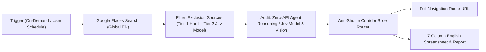

# Universal Public Place Scout & Corridor Planner

## 1. Skill Purpose & Workflow

This skill executes an on-demand or scheduled lead discovery and navigation planning workflow across **any public place types on Google Maps** (restaurants, cafes, auto detailing, fitness centers, dental clinics, retail stores, etc.):
1. **Global Google Maps Places Search (English)**: Queries target regions globally using Google Maps Places API (New) with `languageCode: "en"` and dynamic `includedType` / keyword probe expansion.
2. **Exclusion & Blacklist Location Filtering (Multi-Source & Jev Decision Model)**: Ingests exclusion lists from Excel (.xlsx), CSV, JSON, or REST APIs. Employs tiered matching: Tier 1 Hard Match on Place ID / Phone / Name + Tier 2 TypeSafe AI official `jev-latest` typed decision model (noul/choice via `POST https://api.typesafe.ai/v1/systemone`) on brand aliases and store addresses to eliminate blacklisted and previously recorded locations without false exclusions of distinct chain branches.
3. **Agent Multimodal & Jev Feature Audit**: Leverages TypeSafe AI Jev typed decision models with customizable criteria (`criteria`, `template`: `coffee`, `auto`, `fitness`, `dining`, `general`) to audit descriptions, services, and reviews, combined with agent native multimodal vision inspection of storefront and facility photos.
4. **Anti-Shuttle Corridor Routing**: Slices the directional corridor into depth bins and sweeps local place clusters monotonically forward without back-and-forth oscillation or reversing along the travel axis.
5. **Sequential 10-Stop Google Maps Navigation Legs & Overview URL**: Because Google Maps natively limits turn-by-turn driving routes to 10 stops (1 Origin + 9 Waypoints), formats the stops into sequential driving legs (Leg 1: 1–9, Leg 2: 9–18, Leg 3: 18–27, Leg 4: 27–30) for reliable 1-click mobile driving, plus a master overview URL for desktop review.
6. **7-Column English Spreadsheet & Report Export**: Generates normalized, professionally styled Excel (.xlsx) workbook, CSV, and Markdown report with 7 columns (headers and content strictly in pure English):
   - `No.`
   - `Place Name`
   - `Address` (Detailed location address including unit/suite)
   - `Navigation Address` (Deduplicated canonical driving address, vertically merged across multi-merchant complexes/malls)
   - `Opening Hours` (Condensed weekday schedule)
   - `Phone`
   - `Match Evidence`



---

## 2. Agent Execution Guide

### 0. Strictly Read-Only Engine Guardrail (Agent Mandatory)
> [!CAUTION]
> **CRITICAL AGENT GUARDRAIL: Strict Read-Only Engine Policy**
> 1. **Zero Code Modification**: All scripts under `scripts/` (`main.py`, `places_searcher.py`, `filters.py`, `directional_router.py`, `route_generator.py`, `sheet_exporter.py`, etc.) are fixed, production-grade, deterministically tested execution engines.
> 2. **NEVER Modify Scripts for Ad-Hoc User Queries**: The agent is **STRICTLY FORBIDDEN** from modifying, patching, editing, rewriting, or hardcoding values into any Python scripts or configuration files to fulfill user requests, search areas, custom queries, or visual map inputs.
> 3. **Handling Visual Map Screenshots & Custom Spatial Queries**:
>    When the user uploads a map screenshot, circle, bounding box, or names a custom commercial district (e.g., Markville Mall, Hwy 7, etc.):
>    - **DO NOT** edit `places_searcher.py` or `main.py` to insert hardcoded search keywords or coordinates!
>    - **DO** identify the central coordinate (`latitude, longitude`) or central landmark name and the approximate radius from the image/request.
>    - **DO** invoke the CLI with dynamic flags:
>      ```bash
>      python3 <SKILL_DIR>/scripts/main.py --origin "<latitude>,<longitude>" --direction radial --radius <km>
>      ```
>      Or with regional filtering:
>      ```bash
>      python3 <SKILL_DIR>/scripts/main.py --origin "<landmark>" --include-regions "<region>" --direction radial --radius <km>
>      ```
> 4. **Agent Role is Executor / Conductor Only**: The agent's role is strictly that of an external operator running commands via CLI and interpreting results, NOT a developer modifying the engine's internal code.

### 1. First-Time Setup & Onboarding Protocol (Agent Mandatory)
> [!IMPORTANT]
> **Zero-Terminal Interaction Protocol for Non-Technical Users**:
> 1. **Zero Terminal Exposure**: **NEVER** ask or instruct the user to open a terminal, and **NEVER** output commands like `python3 <SKILL_DIR>/scripts/main.py --setup` for the user to copy-paste. All scripts, parameters, and filesystem operations must be executed silently by the agent in the background. The user's sole interface is the conversation chat window.
> 2. **Proactive Configuration Inspection**:
>    When the user first mentions this skill, installs it into a project, or initiates a prospecting task, the agent MUST silently check the configuration status in the background:
>    ```bash
>    python3 <SKILL_DIR>/scripts/main.py --check-config
>    ```
> 3. **Proactive Interactive Onboarding Protocol (Tool-First)**:
>    Whenever `--check-config` reveals missing credentials (Google Maps Places API Key or TypeSafe API Key for Jev decision model):
>    - **Mandatory Tool Call (Tool-First)**: If the `ask_question` tool is available in the agent environment, the agent **MUST immediately invoke `ask_question` in the same turn** (DO NOT just output plain text inquiry).
>    - **Standard Modal Schema for `ask_question`**:
>      ```json
>      {
>        "questions": [
>          {
>            "question": "Google Maps Place Scout is installed! How would you like to configure it?",
>            "options": [
>              "(Recommended) I will provide my Google Maps API Key and TypeSafe API Key (or paste in chat)",
>              "Skip configuration for now (I will configure it later)"
>            ],
>            "is_multi_select": false
>          }
>        ]
>      }
>      ```
>    - **Follow-up Handling Logic (Agent Next Action - CRITICAL)**:
>      Once `ask_question` returns with the user's selection:
>      - **Case 1: User submitted API Key / config string** (in write-in box or chat):
>        Immediately execute silent backend configuration:
>        ```bash
>        python3 <SKILL_DIR>/scripts/main.py --configure \
>          --set-api-key "<GOOGLE_MAPS_API_KEY>" \
>          --set-typesafe-key "<TYPESAFE_API_KEY>"
>        ```
>        Confirm success in chat and smoothly transition to prospecting questions.
>      - **Case 2: User selected Option 1 but did NOT provide the key string yet**:
>        **DO NOT** simply output a static installation summary and stop! The agent **MUST immediately ask in chat**:
>        *"Great! Please paste your Google Maps API Key (starts with `AIza...`) and optionally your TypeSafe API Key for the Jev decision model:"*
>        and wait for the user to provide the keys.
>      - **Case 3: User selected Option 2 (Skip)**:
>        Conclude politely and inform the user that configuration can be completed later anytime.
>    - **Fallback (When `ask_question` tool is NOT available)**: Only if the host agent platform does not provide `ask_question` (e.g., standard Claude Code or headless API), politely ask the user directly in the chat dialog:
>      - **Google Maps API Key**: *"Please provide your Google Maps API Key to enable live Places exploration."*
>      - **TypeSafe API Key (Optional)**: *"Please provide your TypeSafe API Key to enable `jev-latest` typed decision modeling (POST https://api.typesafe.ai/v1/systemone) for entity resolution and menu auditing."*
>      - **Target Google Sheet Webhook**: *"If you would like automated Google Sheet sync, please share your Google Apps Script Webhook URL (e.g., `https://script.google.com/macros/s/.../exec`)."*
>      - **Default Departure Origin**: *"Where is your preferred starting base? (e.g., 'Fairview Mall, Toronto, ON', an address, or a Google Maps link, or skip to specify later)."*
> 4. **Silent Backend Configuration Write**:
>    When the user replies with any configuration information in chat, the agent executes `--configure` non-interactively behind the scenes:
>    ```bash
>    python3 <SKILL_DIR>/scripts/main.py --configure \
>      --set-api-key "<USER_API_KEY>" \
>      --set-typesafe-key "<TYPESAFE_KEY>" \
>      --set-sheet-url "<USER_WEBHOOK_URL>" \
>      --set-origin "<USER_ORIGIN>"
>    ```
> 5. **Smooth Handoff to Prospecting**:
>    Once saved, confirm politely in chat and immediately transition to prospecting:
>    *"Everything is set up! Which direction or region would you like to explore today (e.g., 'Head East towards Markham' or 'Within 6 km of Fairview Mall')?"*

### Dynamic Configuration & Setup Commands (Agent Backend Only)
Agent executes configuration non-interactively behind the scenes:
```bash
# Check current configuration status (returns JSON with detected mode & paths)
python3 <SKILL_DIR>/scripts/main.py --check-config

# Non-interactive silent configuration update
python3 <SKILL_DIR>/scripts/main.py --configure \
  --set-api-key "AIzaSy..." \
  --set-typesafe-key "typesafe_key_..." \
  --set-sheet-url "https://script.google.com/macros/s/AKfycbz.../exec" \
  --set-origin "Fairview Mall, Toronto, ON"
```
*(Legacy/Terminal power-user interactive wizard: `python3 <SKILL_DIR>/scripts/main.py --setup`)*

### Automatic Dual-Mode Isolation (Zero Pollution Protocol)
The system automatically senses whether it is running within a project workspace or as a global tool:
- **Mode 1: Project Workspace Mode** (installed under `<project>/.agents/skills/...`, `<project>/.gemini/skills/...`, `<project>/skills/...`, or inside a workspace repository):
  - **Zero pollution to `~`**: All configurations and caches stay 100% self-contained inside the project.
  - **Configuration**: `<project_root>/config.json` (gitignored).
  - **Temporary audit files**: `<project_root>/.cache/place_scout/audit/` (gitignored).
  - **Output deliverables**: `<project_root>/output/`.
- **Mode 2: Global / Root Install Mode** (installed under `~/.gemini/config/skills/...`, `~/.agents/skills/...`, or running without a project):
  - Uses standard XDG directories to protect the user's home folder root:
  - **Configuration**: `~/.config/place_scout/config.json`
  - **Cache & Exports**: `~/.cache/place_scout/`
  - **Temporary audit files**: System temp `/tmp/place_scout/audit/`

### Execution Path & Dynamic `<SKILL_DIR>` Resolution (Multi-Agent Compatibility)
> [!IMPORTANT]
> **Universal Path Resolution Guide for Agents**:
> When invoking the script, NEVER use relative paths like `python3 scripts/main.py` because your current working directory (CWD) is the user's workspace, not the skill directory.
>
> **Resolve `<SKILL_DIR>` according to your agent environment**:
> | Platform / Agent | Standard `<SKILL_DIR>` Mount Path | Direct Command |
> | :--- | :--- | :--- |
> | **Google Antigravity (Workspace Standard)** | `<workspace>/.agents/skills/google-maps-place-scout` | `python3 .agents/skills/google-maps-place-scout/scripts/main.py [ARGS]` |
> | **Google Antigravity (Global)** | `~/.gemini/config/skills/google-maps-place-scout` | `python3 ~/.gemini/config/skills/google-maps-place-scout/scripts/main.py [ARGS]` |
> | **Google Antigravity (Legacy Workspace)** | `<workspace>/.gemini/skills/google-maps-place-scout` | `python3 .gemini/skills/google-maps-place-scout/scripts/main.py [ARGS]` |
> | **Anthropic Claude Code** | `~/.claude/skills/google-maps-place-scout` | `python3 ~/.claude/skills/google-maps-place-scout/scripts/main.py [ARGS]` |
> | **Cursor / Windsurf** | `<workspace>/skills/google-maps-place-scout` | `python3 skills/google-maps-place-scout/scripts/main.py [ARGS]` |
> | **Global CLI (`pip install -e .`)** | Registered on system `PATH` | `place-scout [ARGS]` |
>
> **Agent Execution Rule**: In all commands below, `<SKILL_DIR>` denotes your resolved absolute skill path. If `place-scout` is registered on the host system PATH, you can also execute `place-scout [ARGS]` directly.

### Standard Execution
```bash
python3 <SKILL_DIR>/scripts/main.py
```

### Live API & Configuration
To configure your Google Maps API Key and preferences non-interactively:
```bash
python3 <SKILL_DIR>/scripts/main.py --configure --set-api-key "YOUR_GOOGLE_MAPS_API_KEY"
```

### Google Sheet Target & Synchronization Protocol
The skill exclusively synchronizes to Google Sheets via **Google Apps Script Webhook** (zero Google Cloud project setup, zero service accounts, zero `credentials.json`, zero OAuth token expiration issues).

#### 1-Minute Setup Guide
1. In the target Google Sheet, go to **Extensions > Apps Script** (`扩展程序 > Apps 脚本`).
2. Paste the Apps Script code (also stored locally in [google_apps_script.js](resources/google_apps_script.js)):
   ```javascript
   function doGet(e) {
     var ss = SpreadsheetApp.getActiveSpreadsheet();
     var sheetUrl = ss.getUrl();
     var html = '<!DOCTYPE html><html><head>' +
       '<meta http-equiv="refresh" content="0; url=' + sheetUrl + '" />' +
       '<title>正在打开 Google Sheet...</title>' +
       '<style>' +
       'body{font-family:-apple-system,BlinkMacSystemFont,"Segoe UI",Roboto,sans-serif;display:flex;flex-direction:column;align-items:center;justify-content:center;height:80vh;background:#f8fafc;color:#1e293b;margin:0;}' +
       '.card{background:#ffffff;padding:32px 48px;border-radius:12px;box-shadow:0 4px 12px rgba(0,0,0,0.06);text-align:center;max-width:480px;}' +
       'h2{margin-top:0;font-size:20px;color:#0f172a;}' +
       'p{color:#64748b;font-size:14px;line-height:1.6;margin-bottom:24px;}' +
       '.btn{display:inline-block;padding:12px 24px;background:#1a73e8;color:#ffffff;text-decoration:none;border-radius:6px;font-weight:600;font-size:14px;}' +
       '</style>' +
       '</head><body>' +
       '<div class="card">' +
       '<h2>正在跳转至 Google Sheet...</h2>' +
       '<p>如果浏览器没有自动跳转，请点击下方按钮直接打开在线表格：</p>' +
       '<a class="btn" href="' + sheetUrl + '" target="_blank">打开 Google Sheet 在线表格</a>' +
       '</div>' +
       '</body></html>';
     return HtmlService.createHtmlOutput(html)
       .setXFrameOptionsMode(HtmlService.XFrameOptionsMode.ALLOWALL);
   }

   function doPost(e) {
     try {
       var data = JSON.parse(e.postData.contents);
       var ss = SpreadsheetApp.getActiveSpreadsheet();
       var baseTitle = data.sheet_name || ("Route_" + Utilities.formatDate(new Date(), "GMT-4", "yyyy-MM-dd"));
       var sheetName = baseTitle;
       var counter = 2;
       while (ss.getSheetByName(sheetName)) {
         sheetName = baseTitle + " (" + counter + ")";
         counter++;
       }
       var sheet = ss.insertSheet(sheetName);
       ss.setActiveSheet(sheet);
       ss.moveActiveSheet(1);

        var startRow = 1;
        var headers = data.headers || ["No.", "Place Name", "Address", "Navigation Address", "Opening Hours", "Phone", "Match Evidence"];
        if (data.master_nav_url) {
          sheet.getRange(1, 1).setFormula('=HYPERLINK("' + data.master_nav_url + '", "Google Maps Route Navigation")');
          sheet.getRange(1, 1, 1, headers.length).merge()
            .setBackground("#E8F0FE")
            .setFontColor("#1A73E8")
            .setFontWeight("bold")
            .setFontSize(10)
            .setHorizontalAlignment("center")
            .setVerticalAlignment("middle");
          sheet.setRowHeight(1, 34);
          startRow = 2;
        }

        var headerRange = sheet.getRange(startRow, 1, 1, headers.length);
        headerRange.setValues([headers]);
        headerRange.setBackground("#1A73E8")
          .setFontColor("#FFFFFF")
          .setFontWeight("bold")
          .setFontSize(11)
          .setHorizontalAlignment("center")
          .setVerticalAlignment("middle");
        sheet.setRowHeight(startRow, 38);
        sheet.setFrozenRows(startRow);

        if (data.rows && data.rows.length > 0) {
          var dataStartRow = startRow + 1;
          var numRows = data.rows.length;
          var dataRange = sheet.getRange(dataStartRow, 1, numRows, headers.length);
          dataRange.setValues(data.rows);
          dataRange.setFontSize(10).setVerticalAlignment("middle");

          for (var r = 0; r < numRows; r++) {
            var rowNum = dataStartRow + r;
            sheet.setRowHeight(rowNum, 28);
            var rowBg = (r % 2 === 0) ? "#FFFFFF" : "#F8FAFC";
            sheet.getRange(rowNum, 1, 1, headers.length).setBackground(rowBg);
          }

          dataRange.setBorder(true, true, true, true, true, true, "#E2E8F0", SpreadsheetApp.BorderStyle.SOLID);
          sheet.getRange(dataStartRow, 1, numRows, 1).setHorizontalAlignment("center");
          sheet.getRange(dataStartRow, 2, numRows, 1).setFontWeight("bold");
          sheet.getRange(dataStartRow, 3, numRows, 1).setWrapStrategy(SpreadsheetApp.WrapStrategy.WRAP);
          sheet.getRange(dataStartRow, 4, numRows, 1).setWrapStrategy(SpreadsheetApp.WrapStrategy.WRAP);
          sheet.getRange(dataStartRow, 5, numRows, 1).setHorizontalAlignment("center");
          sheet.getRange(dataStartRow, 6, numRows, 1).setHorizontalAlignment("center");
          sheet.getRange(dataStartRow, 7, numRows, 1).setWrapStrategy(SpreadsheetApp.WrapStrategy.WRAP);

          var navCol = 4;
          var mergeStart = 0;
          for (var r = 0; r < numRows; r++) {
            var curNav = data.rows[r][navCol - 1];
            var nextNav = (r + 1 < numRows) ? data.rows[r + 1][navCol - 1] : null;
            if (curNav && curNav === nextNav) {
              // Same navigation address
            } else {
              if (r > mergeStart) {
                var startRowIdx = dataStartRow + mergeStart;
                var mergeHeight = r - mergeStart + 1;
                sheet.getRange(startRowIdx, navCol, mergeHeight, 1).merge()
                  .setVerticalAlignment("middle")
                  .setHorizontalAlignment("left")
                  .setWrapStrategy(SpreadsheetApp.WrapStrategy.WRAP);
              }
              mergeStart = r + 1;
            }
          }
        }

        sheet.setColumnWidth(1, 60);
        sheet.setColumnWidth(2, 220);
        sheet.setColumnWidth(3, 300);
        sheet.setColumnWidth(4, 300);
        sheet.setColumnWidth(5, 180);
        sheet.setColumnWidth(6, 130);
        sheet.setColumnWidth(7, 360);

       return ContentService.createTextOutput(JSON.stringify({ status: "success", sheet_name: sheet.getName(), sheet_url: ss.getUrl() })).setMimeType(ContentService.MimeType.JSON);
     } catch (err) {
       return ContentService.createTextOutput(JSON.stringify({ status: "error", message: err.toString() })).setMimeType(ContentService.MimeType.JSON);
     }
   }
   ```
3. Click **Deploy > New deployment > Web App** (`部署 > 新建部署 > Web 应用`):
   - **Execute as**: `Me (your account)` (`我`)
   - **Who has access**: `Anyone` (`所有人`)
4. Click **Deploy**, grant permission if prompted, and copy the Web App URL (format: `https://script.google.com/macros/s/.../exec`).
5. Configure the Webhook URL in the skill:
   ```bash
   python3 <SKILL_DIR>/scripts/main.py --configure --set-sheet-url "https://script.google.com/macros/s/.../exec"
   ```
*(If no Webhook URL is configured, the skill automatically saves full 7-column reports to local Excel `.xlsx`, CSV, and Markdown files in `<project_root>/output/` with zero crashing.)*

### Custom Exclusion Data Sources (Excel, CSV, API, or JSON)
Pass single or multiple comma-separated custom exclusion sources dynamically:
```bash
python3 <SKILL_DIR>/scripts/main.py \
  --exclusion-sources "~/Desktop/blacklist.xlsx, https://crm.company.com/api/v1/visited-logs"
```

### Custom Departure Origin & Multi-Format Parsing
Specify any custom departure origin via Google Maps link, text address/landmark, or coordinates:
```bash
# 1. Google Maps URL (desktop link or mobile share link)
python3 <SKILL_DIR>/scripts/main.py --origin "https://www.google.com/maps/place/Fairview+Mall/@43.7780,-79.3440,17z"

# 2. Text Address or Landmark Name
python3 <SKILL_DIR>/scripts/main.py --origin "Fairview Mall, Toronto, ON"

# 3. Direct Latitude/Longitude Coordinates
python3 <SKILL_DIR>/scripts/main.py --origin "43.7615, -79.4111"
```

### Spatial Constraints & Direction Control
```bash
# Sweep Eastbound (Default unidirectional corridor)
python3 <SKILL_DIR>/scripts/main.py --direction east

# Radial Proximity Search around an Anchor ("在XXXX附近找")
python3 <SKILL_DIR>/scripts/main.py --origin "Fairview Mall" --direction radial --radius 6.0

# Negative Geofencing: Avoid specific regions ("不要去到士嘉堡 / 避开 Downtown")
python3 <SKILL_DIR>/scripts/main.py --direction east --exclude-regions "scarborough,downtown"

# Positive Geofencing: Strictly confine within specific regions ("只在万锦范围内找")
python3 <SKILL_DIR>/scripts/main.py --include-regions "markham" --max-depth 15.0
```

### Execution Timing & Target Dates (On-Demand & Scheduled)

> **Note on scheduling**: the skill itself is single-run; recurring execution is
> owned by the host agent platform (e.g. a cron job that invokes `main.py`).
> The `schedule` block in `config.example.json` is a convention for the host
> scheduler, not a flag consumed by the CLI.
```bash
# 1. Plan for Today's Route (e.g. executed in the morning or mid-day before departure)
python3 <SKILL_DIR>/scripts/main.py --visit-date today --departure-time 10:00

# 2. Plan for Tomorrow's Route (e.g. executed in the evening for next-day field operations)
python3 <SKILL_DIR>/scripts/main.py --visit-date tomorrow --departure-time 09:30

# 3. Plan for a Specific Calendar Date & Time
python3 <SKILL_DIR>/scripts/main.py --visit-date 2026-09-20 --departure-time 14:00

# 4. Immediate Departure (Today at Current Local Time)
python3 <SKILL_DIR>/scripts/main.py --visit-date today --departure-time <current_HH:MM>

# 5. Auto-Adaptive (Default): Runs before 15:00 default to Today; runs after 15:00 default to Tomorrow
python3 <SKILL_DIR>/scripts/main.py
```

### Dynamic Date & Departure Time Resolution Protocol (Agent Mandatory)
> [!IMPORTANT]
> **User Local Time Anchoring & Time Intent Extraction**:
> 1. **Time Context Awareness**: The agent MUST check the user's current local date and time from the system context (e.g., `<ADDITIONAL_METADATA>` or current system clock).
> 2. **Natural Language Time Parsing**:
>    - When the user mentions explicit time or date expressions ("明天上午10点", "今天下午2点", "明早9点半", "现在出发"), the agent MUST resolve them into 24-hour format `--departure-time "HH:MM"` and corresponding `--visit-date "YYYY-MM-DD"` (or `today` / `tomorrow`).
> 3. **Default Departure Time for Today (No Stale Past Time)**:
>    - If the user requests route planning for **today** (or "现在出发") without specifying an exact departure time, the agent **MUST NOT** let the departure time default to 09:30 AM in the past.
>    - The agent MUST inject the user's current local time: `--visit-date today --departure-time "<current_HH:MM>"`.
> 4. **Default for Tomorrow / Future**:
>    - If the user requests route planning for **tomorrow** or a future date without a specific time, default to standard morning field start: `--departure-time "09:30"` (or let the engine default).

### Natural Language Intent Translation for Agents
When interacting with the user, the agent automatically maps natural language instructions into CLI parameters:
| User Request | Agent Execution Mapping |
| :--- | :--- |
| "帮我规划今天的拜访路线，上午 10 点出发" | `--visit-date today --departure-time 10:00` |
| "今天下午 2 点出发去扫街" | `--visit-date today --departure-time 14:00` |
| "规划明天去多伦多东边的路线，明早 9 点半走" | `--visit-date tomorrow --departure-time 09:30 --direction east` |
| "现在立刻出发，在北约克附近找 30 家" | `--visit-date today --departure-time "<current_HH:MM>" --origin "North York" --direction radial` |
| "规划今天的路线" (未指明具体时间) | `--visit-date today --departure-time "<current_HH:MM>"` (对齐当前本地时间，防止过期) |
| "规划明天去多伦多东边的路线" (未指明具体时间) | `--visit-date tomorrow --direction east` (默认 09:30) |
| "下周一上午 10 点从大本营出发" | `--visit-date <YYYY-MM-DD> --departure-time 10:00` |
| "在 Fairview Mall 附近找 30 家店" | `--origin "Fairview Mall" --direction radial --radius 6.0` |
| "在曼哈顿寻找 20 家精品独立手冲咖啡馆" | `--origin "Times Square, New York" --place-types cafe --template coffee --count 20 --direction radial --radius 5.0` |
| "规划沿走廊拜访 15 家汽修与汽车贴膜店" | `--place-types car_repair,car_wash --template auto --criteria "auto detailing, PPF, ceramic coating" --count 15 --direction east` |
| "在市中心附近搜集 25 家健身房与搏击馆" | `--place-types gym --template fitness --criteria "commercial gym, CrossFit, boxing studio" --count 25 --direction south` |
| "以 A (如 Field Operations Base) 为出发地址，在截图范围内找 30 家店" | `--origin "A" --search-center "<lat>,<lng>" --search-radius <km> --bounds "<min_lat,min_lng,max_lat,max_lng>"` |
| "提供地图截图 / 圈选范围 / 在图示范围找" | 提取中心与矩形边界，调用 `--search-center "<lat>,<lng>" --search-radius <km> --bounds "<min_lat,min_lng,max_lat,max_lng>"` |
| "以 Markville Mall 为核心找周边 1.5 公里" | `--search-center "CF Markville, Markham" --search-radius 1.5` |
| "以这个地图链接出发向东扫街: [URL]" | `--origin "<URL>" --direction east` |
| "从北约克向东扫，但不要去士嘉堡" | `--direction east --exclude-regions "scarborough"` |
| "只在万锦范围内找，15公里以内" | `--include-regions "markham" --max-depth 15.0` |
| "避开 Downtown，在北约克找" | `--exclude-regions "downtown" --include-regions "north york"` |
| "不要去 Shell 或者 Esso" | `--exclude-places "Shell, Esso"` |
| "带上或者必须拜访 Pilot Coffee Roasters" | `--include-places "Pilot Coffee Roasters"` |
| "晚上去巡检，把仅夜间营业的场所也带上" | `--allow-dinner-only` |
| "不用检查开门时间，所有店都排进来" | `--keep-closed` |

---

---

## 3. Human-Agent-Code Tripartite Orchestration & Multimodal Protocol

This skill is architected around a **Tripartite Collaboration Framework (人 - 智能体 - Python 确定性代码)**:

```
+-----------------------------------------------------------------------------+
|                                    HUMAN                                    |
|             Natural language intent, origin preferences, constraints        |
+-----------------------------------------------------------------------------+
                                       |
                                       v
+-----------------------------------------------------------------------------+
|                             AI AGENT (The Conductor)                         |
|   - Interprets human intent and maps parameters silently                    |
|   - Dispatches Python execution tools in the background                     |
|   - Steps in as Multimodal Visual Judge on ambiguous candidate photos       |
|   - Delivers executive in-chat reports and navigation links to human        |
+-----------------------------------------------------------------------------+
               |                                              ^
               | Invokes scripts                              | Emits structured signals
               v                                              | (Pending images, logs)
+-----------------------------------------------------------------------------+
|                          PYTHON EXECUTION ENGINE                            |
|   - Google Maps Places API exploration & corridor probe deployment          |
|   - Tier 1 Jev text triage: fast pass (P >= 0.85), fast reject (P <= 0.30)  |
|   - Downloads candidate facility/storefront photos for borderline cases      |
|   - Monotonic Anti-Shuttle Corridor Slice Sweep geometry routing            |
|   - Pure English 7-column Excel & Google Sheets webhook data persistence    |
+-----------------------------------------------------------------------------+
```

### Cascaded Multimodal Inspection Protocol & Zero-API Handshake
1. **Zero-API Mode (No Jev Key Required)**:
   When no JEV API Key is configured, the system activates the **Agent-Native Cognitive Handshake Protocol**. Rather than silently falling back to brittle keyword matching, the Python engine exports candidate places and downloaded photos to a prompt-ready packet `pending_agent_audit.json` and emits `[AGENT_ACTION_REQUIRED]`.
2. **Fast Text Triage (When Jev Key is Present)**:
   If Jev (`jev-latest` via TypeSafe System One API) is configured, it resolves 80%+ of obvious candidates in milliseconds. Only borderline candidates ($0.30 < P < 0.85$, such as hybrid venues or multi-service centers) have their photos downloaded and routed to the Agent.
3. **Agent Action Required SOP (Mandatory for Host AI Agent)**:
   > [!IMPORTANT]
   > **Agent Autoloop & Re-execution Protocol**:
   > When the executing AI Agent receives the `[AGENT_ACTION_REQUIRED]` banner:
   > 1. **DO NOT** stop and present an incomplete route or failure message to the human user.
   > 2. Read `<temp_dir>/audit/pending_agent_audit.json` using `view_file` or file read tools.
   > 3. For candidates with `local_photo_paths`, inspect the storefront and interior photos using native multimodal `view_file`.
   > 4. Evaluate each candidate against `target_criteria` using your own reasoning and vision.
   > 5. Write the final verdicts to `<temp_dir>/audit/agent_audit_results.json` (format: dictionary `{ "<placeId>": { "is_match": true/false, "matched_features": [...], "rationale": "..." } }` or list).
   > 6. **Immediately re-run the exact same Python command**. The second run will load your decisions with 100% precedence, bypass the pause, and generate the final 30-stop route seamlessly.

4. **Verdict Ingestion & Priority Locking**:
   The Agent records the verified decisions in `<temp_dir>/audit/agent_audit_results.json`:
   ```json
   {
     "ChIJ...": {
       "is_match": true,
       "matched_features": ["specialty equipment", "dedicated workspace"],
       "rationale": "Verified by Agent multimodal visual inspection: Storefront and facility photos confirm criteria match"
     }
   }
   ```
   Future runs immediately ingest this file with 100% priority, ensuring persistent memory without re-evaluating.

---

## 4. Routing & Data Normalization Specifications

### Anti-Shuttle Corridor Slice Sweep
- Projects candidate coordinates onto the travel axis (along-track distance $s$, cross-track distance $w$).
- Bins candidates into forward depth slices ($\Delta s = 2.0$ km).
- Within each slice, visits local merchants via nearest-neighbor clustering.
- Advances strictly forward slice-by-slice, preventing any backward travel ($\Delta s < 0$).

### 30-Stop Slash Navigation URL
Bypasses waypoint limits by formatting all locations into the URL path:
```text
https://www.google.com/maps/dir/{origin}/{stop1}/{stop2}/.../{stop30}/
```

### Simplified Weekday Operating Hours
Summarizes Monday–Friday schedules into concise English strings:
- Uniform weekdays: `"11:00 AM – 10:00 PM"`
- Exception day: `"11:00 AM – 10:00 PM (Mon Closed)"`
- Variant hours: `"11:00 AM – 10:00 PM (Fri: 11:00 AM – 11:00 PM)"`

---

## 5. Output Deliverables & Cloud Sync

### Primary Deliverables
1. **Google Sheets (Live Cloud Table)**:
   Synced directly to target Google Sheet via Google Apps Script Webhook.
2. **Master Google Maps 30-Stop Navigation URL**:
   Formatted directly in the terminal and embedded into the spreadsheet header.
3. **Local Route Backups**:
   Saved to `output/` (or `~/.cache/place_scout/routes/` when running project-free):
   - `route_YYYY-MM-DD_<direction>.xlsx` (7-column professionally styled Excel workbook with vertically merged navigation cells for plazas/malls)

### Intermediate Files (Temporary)
- Stored exclusively in system temporary path: `/tmp/place_scout/audit/pending_agent_audit.json`
- Does not clutter the current working directory.

---

## 6. Agent In-Chat Presentation Protocol (Mandatory)

> [!IMPORTANT]
> **Zero Console Dependency for End Users**:
> Non-technical end users do NOT inspect background command execution logs or terminal consoles.
> When `main.py` finishes executing:
> 1. The agent MUST parse the `【AGENT IN-CHAT REPORT】` block from the command output (or read `<output_dir>/latest_route_summary.md` / `latest_route_summary.json`).
> 2. The agent MUST render the complete route report directly into the conversational chat window for the user.
> 3. The agent's conversational response MUST include:
>    - **Executive Summary**: Visit date, corridor direction, departure origin, and verified stop count.
>    - **Turn-by-Turn Driving Legs (Primary Navigation)**: Clickable links for the sequential driving legs (e.g. Leg 1: 1–9, Leg 2: 9–10) — strictly conforming to Google Maps' 10-stop limit (1 origin + 9 waypoints) so each leg opens reliably on mobile and desktop without truncation or lookup failures.
>    - **Master Route Overview**: A clickable desktop overview link: `[Google Maps 路线导航](<master_slash_url>)`.
>    - **Live Google Sheet**: If enabled, a direct clickable link to the synced cloud spreadsheet.
>    - **Route Schedule Table**: A clean GFM Markdown table of the stops (Index, Place Name, Address, Operating Hours, Phone, Match Evidence).
>    - **Deliverables Links**: Direct clickable link to the exported Excel workbook (`.xlsx`).
> 4. **NEVER** just say "The command finished successfully" or "Check the terminal logs". Always bring the complete route deliverables directly into the chat dialogue!
